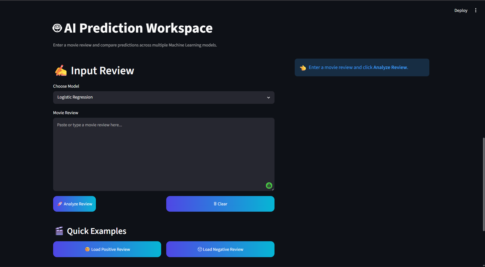
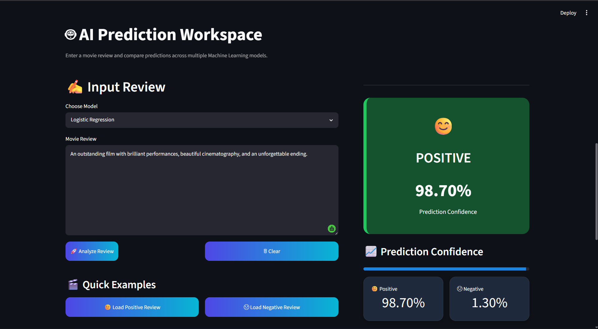
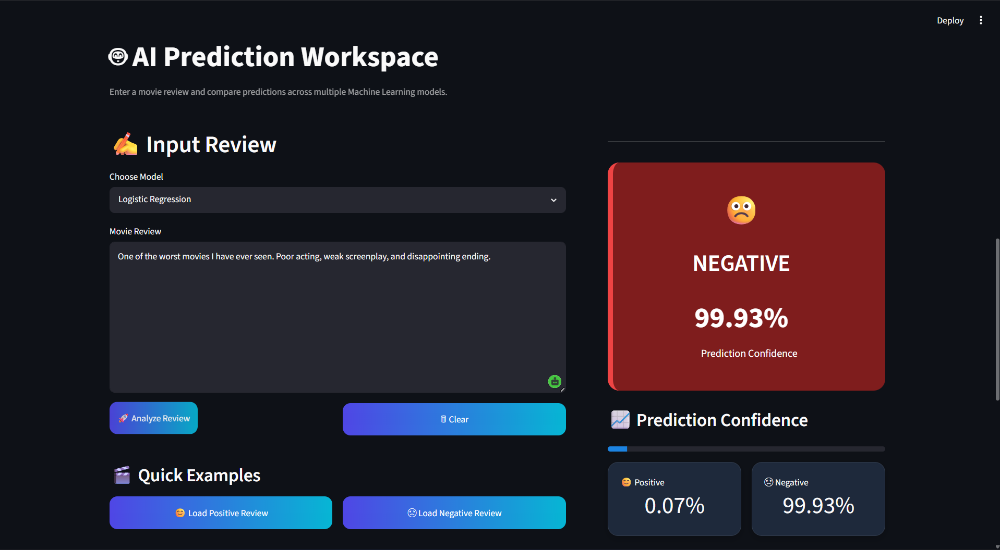
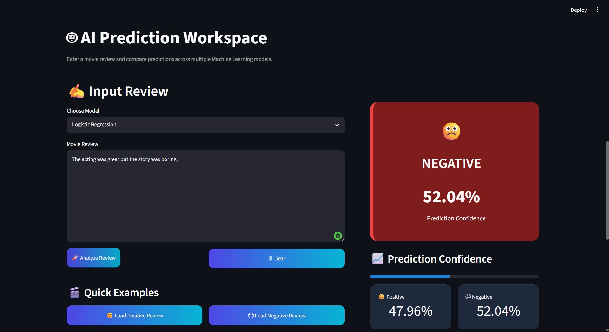

<h1 align="center">🎬 Sentiment Analysis Engine</h1>

End-to-End NLP & Machine Learning · IMDB Movie Reviews · Production-Ready

**Binary sentiment classifier** built on the IMDB Movie Reviews dataset. Ships with a trained Logistic Regression, Naive Bayes, and Linear SVM — plus a Streamlit web app, a FastAPI backend, and a Jupyter notebook walkthrough.

---

## 📌 Table of Contents

- [Overview](#-overview)
- [Key Features](#-key-features)
- [Live Demo Walkthrough](#-live-demo-walkthrough)
- [Pipeline Architecture](#-pipeline-architecture)
- [Dataset](#-dataset)
- [NLP Preprocessing](#-nlp-preprocessing)
- [Feature Engineering](#-feature-engineering)
- [Model Training](#-model-training)
- [Results](#-results)
- [Project Structure](#-project-structure)
- [Installation & Usage](#-installation--usage)
- [REST API](#-rest-api)
- [Tech Stack](#-tech-stack)
- [Future Improvements](#-future-improvements)
- [Author](#-author)

---

## 🧠 Overview

The **Sentiment Analysis Engine** is a complete, end-to-end Natural Language Processing system that classifies movie reviews as **Positive** or **Negative**. It was built to demonstrate the full ML product lifecycle that a real-world NLP system requires — not just a model in a notebook, but a packaged, deployable application:

- **Data validation** — schema checks, deduplication, label normalization
- **Text preprocessing** — a custom NLP cleaning pipeline with negation-aware tokenization
- **Feature engineering** — TF-IDF vectorization tuned for sparse text data
- **Model selection** — three classical ML algorithms trained and tuned with cross-validated grid search
- **Evaluation** — precision/recall/F1, confusion matrices, and side-by-side model comparison
- **Deployment** — an interactive Streamlit web app, a FastAPI REST service, and a multi-stage Docker build

This project intentionally uses **classical, interpretable ML** (Logistic Regression, Naive Bayes, Linear SVM) rather than black-box deep learning — proving that with solid feature engineering, traditional methods can reach **~90% accuracy** on real-world sentiment data while staying fast, lightweight, and explainable.

---

## ✨ Key Features

- 🔍 **Real-time single review prediction** with confidence scores and class probabilities
- 📂 **Batch prediction** — upload a CSV of reviews and download predictions in bulk
- 🤖 **Model comparison** — switch between Logistic Regression, Naive Bayes, and Linear SVM at inference time
- 📊 **Built-in evaluation dashboard** — accuracy/precision/recall/F1 bar charts generated live from training output
- 🧮 **Negation-aware preprocessing** — correctly distinguishes "good" from "not good" instead of stripping negation words as stopwords
- 🎨 **Polished, custom-themed UI** built with Streamlit (dark mode, gradient hero banner, metric cards)
- 🌐 **REST API** for programmatic / production integration via FastAPI
- 🐳 **One-command Docker deployment** with a multi-stage build for a lean production image
- 📈 **Reproducible training pipeline** — `python main.py` regenerates models, reports, and confusion matrices from scratch

---

## 🖥️ Live Demo Walkthrough

### Prediction Workspace
A clean dual-pane interface — paste a review on the left, get an instant verdict on the right.



### ✅ Positive Review

> *"An outstanding film with brilliant performances, beautiful cinematography, and an unforgettable ending."*



### ❌ Negative Review

> *"One of the worst movies I have ever seen. Poor acting, weak screenplay, and disappointing ending."*



### 🤔 Mixed / Nuanced Review

The model handles genuinely ambiguous sentiment gracefully, returning a low-confidence, near 50/50 split instead of a falsely confident verdict:

> *"The acting was great but the story was boring."*



---

## 🏗️ Pipeline Architecture

```
┌──────────────┐    ┌───────────────┐    ┌──────────────┐    ┌─────────────┐    ┌────────────────┐
│  Raw Review  │ →  │ Preprocessing │ →  │   TF-IDF     │ →  │  ML Model   │ →  │   Prediction    │
│   (text)     │    │  (clean/lemma)│    │ Vectorizer   │    │ (LR/NB/SVM) │    │ + Confidence    │
└──────────────┘    └───────────────┘    └──────────────┘    └─────────────┘    └────────────────┘
                                                                                          │
                                                                          ┌───────────────┴───────────────┐
                                                                          │                                │
                                                                  Streamlit Dashboard               FastAPI REST API
                                                                  (interactive UI)                  (/predict, /predict/batch)
```

Each trained model is serialized as a single `scikit-learn` **Pipeline** object (`TfidfVectorizer` + classifier), so the exact same preprocessing and vectorization logic used in training is guaranteed at inference time — eliminating train/serve skew.

---

## 📊 Dataset

| Property | Value |
|---|---|
| Source | IMDB Movie Reviews dataset |
| Total reviews | 50,000 |
| Class balance | 25,000 Positive / 25,000 Negative (perfectly balanced) |
| Avg. review length | ~231 words (~1,309 characters) |
| Review length range | 4 – 2,470 words |
| Train / test split | 80% / 20% (stratified, `random_state=42`) |

Balanced classes mean accuracy is a trustworthy headline metric here — but precision, recall, and F1 are tracked per-class regardless, to catch any asymmetric error patterns.

---

## 🧹 NLP Preprocessing

Implemented in `src/preprocessing.py`, the cleaning pipeline runs every review through:

1. **Lowercasing** — normalizes case
2. **HTML tag stripping** — IMDB reviews contain raw `<br />` tags
3. **URL removal**
4. **Punctuation & digit removal**
5. **Tokenization** (NLTK)
6. **Negation tagging** — `not`, `no`, and `nor` are preserved (not treated as stopwords) and the following token is prefixed, e.g. *"not good"* → `not good_x`, so the classifier learns negated phrases as distinct signals instead of losing the negation entirely
7. **Stopword removal** — using NLTK's English stopword list, with negators explicitly excluded from removal
8. **Lemmatization** — `WordNetLemmatizer` reduces words to their dictionary root form

This negation-aware step is a deliberate design choice: naively removing "not" as a stopword (a common beginner mistake in sentiment pipelines) would cause *"not good"* and *"good"* to look identical to the model.

---

## 🔢 Feature Engineering

Text is converted into numerical features using **TF-IDF (Term Frequency–Inverse Document Frequency)**, configured in the training pipeline as:

```python
TfidfVectorizer(
    lowercase=True,
    strip_accents="unicode",
    max_features=20000,
    ngram_range=(1, 2),     # unigrams + bigrams
    min_df=3,                # ignore terms in fewer than 3 documents
    max_df=0.90,              # ignore terms in over 90% of documents
    sublinear_tf=True,        # log-scaled term frequency
)
```

Bigrams allow the model to capture short phrases like *"not great"* or *"highly recommend"* that unigrams alone would miss.

---

## 🤖 Model Training

Three classical ML algorithms are trained and tuned via **5-fold `GridSearchCV`** (in `src/trainer.py`):

| Model | Algorithm Type | Hyperparameters Tuned |
|---|---|---|
| **Logistic Regression** | Linear classifier | `C ∈ {0.1, 1, 10}`, `solver="liblinear"` |
| **Multinomial Naive Bayes** | Probabilistic classifier | `alpha ∈ {0.1, 0.5, 1.0}` |
| **Linear SVM** (calibrated) | Max-margin classifier | `C ∈ {0.1, 1, 10}` (via `CalibratedClassifierCV` for probability outputs) |

Each model is wrapped in a `scikit-learn Pipeline` alongside its TF-IDF vectorizer, trained on the 80% split, and evaluated on the held-out 20% test set (9,917 reviews). Trained pipelines are serialized with `joblib` to `models/`, and reports/confusion matrices are written to `outputs/`.

---

## 📈 Results

| Model | Accuracy | Precision | Recall | F1-Score |
|---|:---:|:---:|:---:|:---:|
| **Logistic Regression** | **90.05%** | 90.06% | 90.05% | 90.05% |
| **Linear SVM** | **90.05%** | 90.05% | 90.05% | 90.05% |
| Multinomial Naive Bayes | 88.01% | 88.03% | 88.01% | 88.01% |

*(Metrics computed on a 9,917-review held-out test set. Full per-class classification reports are in `outputs/`.)*

### In-App Evaluation Dashboard

The Streamlit app includes a live evaluation dashboard that reads `outputs/model_comparison.csv` and renders accuracy/precision/recall/F1 comparison charts on demand — no need to dig through CSVs manually.

---

## 📂 Project Structure

```
sentiment-analysis-engine/
├── app/
│   ├── streamlit_app.py         # Main interactive dashboard (prediction + batch UI)
│   ├── evaluation_dashboard.py  # Live model comparison charts
│   ├── components.py            # Reusable UI components (hero banner, stat cards)
│   ├── styles.py                # Custom CSS theming
│   └── api.py                   # FastAPI REST backend
├── src/
│   ├── config.py                 # Centralized paths & constants
│   ├── data_loader.py            # Dataset loading, validation, deduplication
│   ├── preprocessing.py          # Text cleaning, negation handling, lemmatization
│   ├── feature_engineering.py    # TF-IDF vectorization
│   ├── trainer.py                # Training, hyperparameter tuning & evaluation pipeline
│   ├── evaluation.py             # Metrics & reporting utilities
│   ├── predictor.py              # Inference wrapper for trained model pipelines
│   └── utils.py                  # Logging, pickling, timing helpers
├── data/raw/imdb_dataset.csv     # 50,000-review IMDB dataset
├── models/                       # Trained pipelines (.pkl) — vectorizer + classifier bundled
├── outputs/                      # Classification reports, confusion matrices, comparison CSV
├── notebooks/experimentation.ipynb  # EDA & prototyping notebook
├── screenshots/                  # App UI screenshots (used in this README)
├── main.py                       # Entry point — trains all models end-to-end
├── requirements.txt
├── Dockerfile                    # Multi-stage build
└── docker-compose.yml            # Streamlit + API services
```

---

## ⚙️ Installation & Usage

### Prerequisites
- Python 3.11+
- pip

### 1. Clone & install

```bash
git clone https://github.com/yoshitagandhi/sentiment-analysis-engine.git
cd sentiment-analysis-engine
pip install -r requirements.txt
```

### 2. Train the models

```bash
python main.py
```

This loads the dataset, preprocesses all 50,000 reviews, trains and tunes all three models with grid search, and writes trained pipelines to `models/` plus evaluation reports to `outputs/`.

### 3. Launch the dashboard

```bash
streamlit run app/streamlit_app.py
```

Open `http://localhost:8501` to analyze reviews, run batch predictions on a CSV, and view the evaluation dashboard.

### 4. Or run everything with Docker

```bash
docker-compose up --build
```

| Service | URL |
|---|---|
| Streamlit dashboard | `http://localhost:8501` |
| FastAPI service | `http://localhost:8000` |

---

## 🌐 REST API

The FastAPI backend (`app/api.py`) exposes a production-style HTTP interface for programmatic access:

| Method | Endpoint | Description |
|---|---|---|
| `GET` | `/health` | Health check for monitoring / load balancers |
| `POST` | `/predict` | Single review prediction with confidence + probabilities |
| `POST` | `/predict/batch` | Batch prediction (up to 500 reviews per request) |

**Example request:**

```bash
curl -X POST http://localhost:8000/predict \
     -H "Content-Type: application/json" \
     -d '{"review": "This movie was fantastic!", "model": "logistic_regression"}'
```

> ⚠️ **Note:** the API module currently has a couple of stale internal imports (`src.predict` / `get_logger`) left over from a refactor — they need to be pointed at the existing `src.predictor.SentimentPredictor` and `src.utils.setup_logger` before the API service will run. The endpoint contracts above reflect the intended design.

---

## 🛠️ Tech Stack

| Category | Tools |
|---|---|
| **Language** | Python 3.11 |
| **ML / NLP** | scikit-learn, NLTK |
| **Data Handling** | pandas, NumPy |
| **Visualization** | Matplotlib, Seaborn, Plotly |
| **Web App** | Streamlit |
| **API** | FastAPI, Uvicorn, Pydantic |
| **Deployment** | Docker, Docker Compose (multi-stage build) |
| **Experimentation** | Jupyter Notebook |

---

## 🔮 Future Improvements

| Enhancement | Description |
|---|---|
| **Transformer models** | Fine-tune BERT / DistilBERT for higher accuracy on nuanced reviews |
| **Ensemble methods** | Combine Logistic Regression, SVM, and Naive Bayes via soft voting |
| **Aspect-based sentiment** | Score sentiment per aspect (acting, plot, visuals) instead of one overall label |
| **Sarcasm detection** | Handle ironic or sarcastic phrasing that confuses lexical models |
| **Multilingual support** | Extend beyond English-language reviews |
| **Cloud deployment** | Ship the FastAPI service to AWS / GCP / Render with CI/CD |

---

## 🙋 Author

**Yoshita Gandhi**
B.Tech, Artificial Intelligence & Data Science — Guru Gobind Singh Indraprastha University

[](https://github.com/yoshitagandhi)

---

## 📄 License

This project is licensed under the MIT License.
